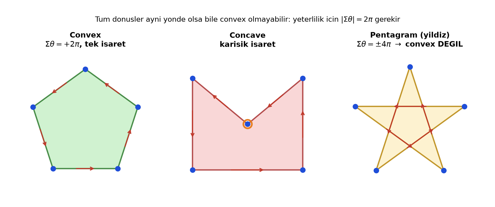
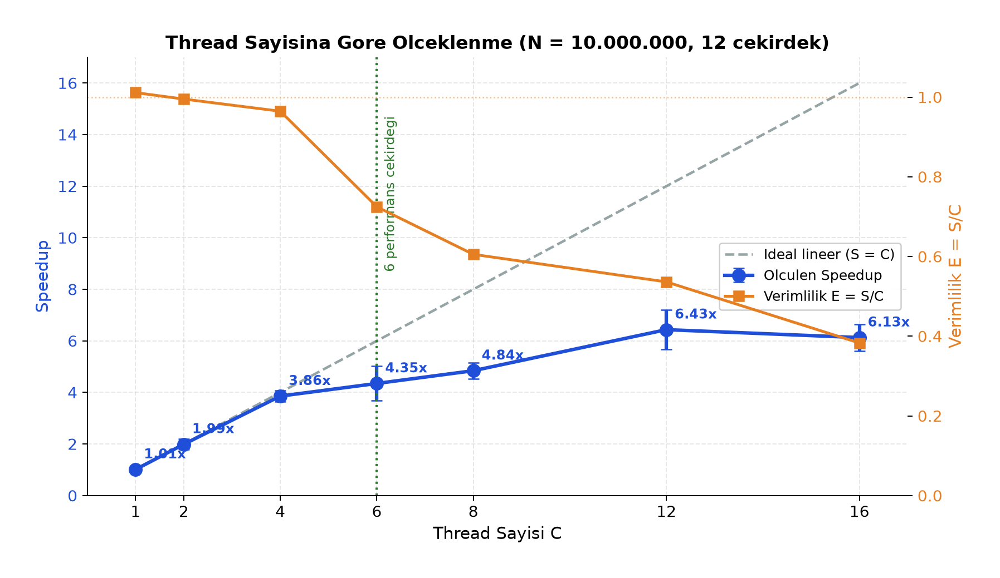

# Paralel Convex Poligon Kontrolü

> Sıralı `(x, y)` koordinatlarından oluşan bir poligonun **dışbükey (convex)** olup olmadığını,
> Java iş parçacıkları (threads) ile **paralel** olarak saptayan bir uygulama.

Paralel Programlama dersi dönem projesi. Çözüm hem **seri** hem de **çok çekirdekli (paralel)**
olarak gerçeklendi; iki sürümün süreleri ölçülerek hızlanma katsayısı (speedup) hesaplandı.

## Ekip

| Ad | Numara |
|----|--------|
| Duha Keskin | 22360859003 |
| Yunus Alim Avşar | 23360859710 |

## Problem

Düzlemde sırayla verilmiş `n` köşeden oluşan kapalı bir poligonun convex olup olmadığını
belirlemek istiyoruz. Bu, çarpışma denetimi, robot hareket planlama ve CBS gibi alanlarda
sık karşılaşılan temel bir geometrik işlemdir ve **veri-paralel** bir yapıya sahiptir:
her köşedeki hesap diğerlerinden bağımsızdır.

## Algoritma

Ardışık üç köşe için dönüş yönü, çapraz çarpımın (cross product) işareti ile bulunur:

```
z = (x₂ − x₁)(y₃ − y₂) − (y₂ − y₁)(x₃ − x₂)
```

`z > 0` sola, `z < 0` sağa, `z = 0` doğrusal dönüş demektir.

> **Önemli ayrıntı:** "Tüm dönüşler aynı yönde" koşulu konvekslik için **gerekli ama yeterli
> değildir** — bir pentagram (yıldız) da tüm dönüşleri aynı yönde olduğu hâlde convex değildir.
> Yeterlilik için işaretli dönüş açılarının toplamının `±2π` olduğunu (sınırın tam bir kez
> dolandığını) da kontrol ederiz. Böylece kendiyle kesişen ve dejenere girdiler doğru reddedilir.



### Paralel tasarım

`N` noktalık dizi, çekirdek sayısı kadar parçaya (chunk) bölünür. Her parça ayrı bir
`Callable<ChunkResult>` görevi olarak **paylaşılan bir thread havuzunda** çalışır ve kendi
işaret + açı toplamını döndürür. Nihai karar `Main.decide()` içinde, **kilit kullanılmadan**
bir reduction ile verilir — paylaşılan değişkene yazılmadığı için `synchronized`/`Lock`
gerekmez.

## Proje yapısı

```
src/
  Point.java               (x, y) veri sınıfı
  ChunkResult.java         bir chunk'ın sonucu (işaret, açı toplamı, mixed)
  ConvexCheckerTask.java   Callable<ChunkResult> — chunk taraması
  Main.java                veri üretimi, ölçüm, birleştirme, CSV çıktısı
out/                       derlenmiş .class dosyaları
results.csv                veri büyüklüğüne göre ölçümler
results_threads.csv        thread sayısına göre ölçümler
figures/                   sonuç grafikleri
rapor.pdf / rapor.tex      proje raporu (5 sayfa)
SUNUM.docx                 sunum
```

## Derleme ve çalıştırma

```bash
javac -d out src/*.java
java -Xmx4g -cp out Main
```

Program önce **doğruluk testlerini** koşar (convex, concave, pentagram, dejenere, `n<3`),
ardından ölçümleri yapıp `results.csv` ve `results_threads.csv` dosyalarına yazar.

Raporu kaynaktan üretmek için (XeLaTeX):

```bash
tectonic rapor.tex     # -> rapor.pdf
```

## Sonuçlar

Test ortamı: **Apple M3 Pro** (12 çekirdek = 6 performans + 6 verim), 18 GB, JDK 21.

Sabit `C = 12` thread, veri büyüklüğüne göre:

| N | Seri (ms) | Paralel (ms) | Speedup | Verim |
|--:|--:|--:|--:|--:|
| 10 000 | 0.088 | 0.065 | 1.35× | %11 |
| 100 000 | 0.867 | 0.239 | 3.63× | %30 |
| 1 000 000 | 8.198 | 1.453 | 5.64× | %47 |
| 10 000 000 | 82.64 | 13.05 | **6.33×** | %53 |

Küçük `N`'de paralel sürüm overhead nedeniyle daha yavaştır; kırılma noktası `N ≈ 10⁴`'tür.
Sabit `N = 10⁷` için thread sayısına göre hızlanma:



Verimlilik 6 performans çekirdeği sınırına kadar `≈ 1`; sonrasında (daha yavaş verim
çekirdekleri devreye girince) düşer. Ayrıntılı analiz (Amdahl Yasası + Karp–Flatt seri-pay
metriği) için **[`rapor.pdf`](rapor.pdf)**'e bakınız.

## Not

Ölçüm sayıları çalışılan makineye ve JVM sürümüne göre değişir; yukarıdaki değerler yukarıdaki
ortamda alınmıştır. Tekrar çalıştırıldığında `results.csv` güncel makinenin sonuçlarıyla
yenilenir.
